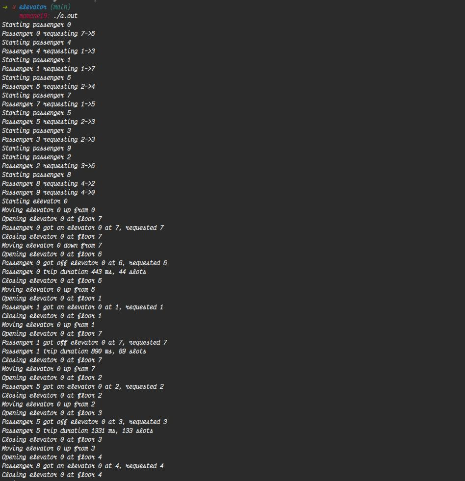

# Elevator Simuation using C

Authors: Mamane Bello, Liplan Lekipsing, Cédric Murairi, and Serge Anan <br>

---


## Get Started
To run the **program** type these commands one after another in your terminal inside the directory of the project:
```bash
$ gcc main.c -pthread
```
then
```
$ ./a.out
```


***

## Good to know

The general idea behind the program is to make it look as much closer to a lift as possibe. I guess that's why it is called a simulation :)
But this is something somehow a bit different. There are some tipic rules. For instance you can not enter inside the elevator when you call it and it comes to you unless it is going the direction you want to go. If you are going up and the elevator is going down, you can not enter. It takes a maximum of 10 passengers and each passenger has one trip each as defined per these global variables: `#define PASSENGERS 10` and `#define TRIPS_PER_PASSENGER 1`


***
## Approach

As long as the approach is concerned I think the code is self-explanatory and the comments also help break through and understand what is going on.
But I am gonna list the key points here and also how we went to ideationa and concluding to the approach.
Our first meeting was just an ideation one where we tried to understand the problem first and discuss some random thoughts on how we can break it down. Liplan was leading the meeting and we come up with three main points:
- `Bello` suggested that we make use of functions for each the passengers and elevator. 
- Then liplan added to that we can define the threads inside the main function and call those functions mentionned by Bello to combine the work. But now the biggest question was how can we make it move like the elevator?
- That's when `Cédric` stepped up and suggested that we make use of structs for easy management of the passengers.
We wrapped up on that meeting and gave a general task to thing of how best we can use what we have discussed to come up with a solid and strong logic to make it work.
<br>
Then we had a second meeting and here is a summary of how it went:
- `Bello` added on Ced's idea of structs and suggested that we add inside our structs the status of the passengers. Since this is gonna be random we will have `Waiting`, `Entered` and `Exited`. Those are the three possible stages.
- `Serge` asked about the threads and suggested that we initiate them directly inside the struct.
- `Liplan` walked us through how he would think of the Elevator thread inside the struct as well as the different statuses of the elevator.
- `Cedric` talked about how we can make the elevator move and we all ended up agreeing on using different functions to do so.
- `Bello` suggested that we have a function that checks the passenger request.
- `Liplan` added that we need to have different functions that will check the elevator status.
- `Serge` suggested that we note all that down and kinda draw a state and make a visual of all those functions.
- We did that and come up with all the different functions and a rough brute force algorithm.
  
  Beow is the actual logic we come up with

  - [x] We initialiaze the timer by scheduling it with some delays
  - [x] A function to handle the passenger request
  - [x] A function to check if the elevator is ready and call in the move function to get it to the passenger.
  - [x] different functions for opening the elevator, closing and checking the direction in which it is going, so that we know if the passenger can enter or not.
  - [x] Once all checks and the conditions are satisfied the function that handles the start of the elevator is callled and start the elevator followed by the move one.   
  - [x] As for the passenger there are different functions as well to check if he was able to enter, or he exited or he is waiting for the elevator to come. Basically checking the passenger's state. We called those functions state management functions :)..
  - [x] After all those checkings and validations, we definitely needed to draw a state in which we manage all the states of both the passenger and elevator. As well as managing through the floors.


***
## Outputs
<p>


</p>

<br>

<h2 align="center"> And Voila! We are done!</h2>


